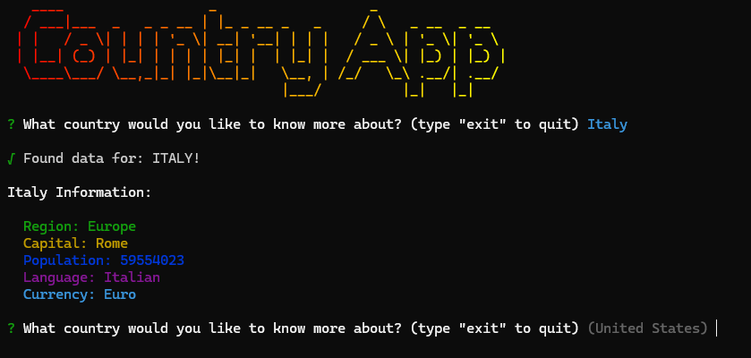

# Country App



This is a simple application that uses the [REST Countries API](https://restcountries.com/) to display information about countries through the command line. The application is built using Node.js, Chalk, Inquirer, Gradient String, Chalk Animation, Figlet, and Nanospinner.

To run the application, clone the repository and type in the terminal:

```bash
npm install
```

```bash
node .
```